# AniConnect

**Bringing Movie Enthusiasts Together with an AI-Driven Platform.**
AniConnect is an iOS app designed for movie lovers to discover films, participate in discussions, and enjoy personalized, AI-powered experiences.

> This is just a bare-minimum app, developed overnight(meh, not sophisticated enough).

---

### Backend Repo - [Faysal-star/AniConnect_backend](https://github.com/Faysal-star/AniConnect_backend/)

---

## Technology Stack

- **Client Side:** SwiftUI
- **Server Side:** Node.js & Express
- **Database:** MongoDB & Mongoose
- **Authentication:** Firebase Auth
- **AI Integration:** OpenAI GPT-4o
- **Hosting:** Vercel

## Key Features

- **User Management**: Secure authentication with Firebase.
- **Categorized Movie List**: Browse movies by genres.
- **Search**: Quickly find movies.
- **Forum**: Post and read reviews.
- **Favorites**: Save movies for quick access.
- **AI Recommender**: Context-aware recommendations.
- **AI Chat**: Discuss movies and shows with AI.

---

## Screenshots

### Auth

|  Sign In  | Sign Up   | 
|-------------|-------------|
| 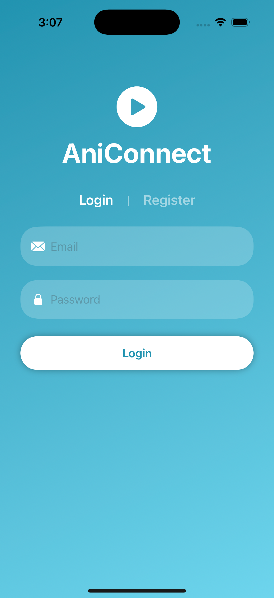 | 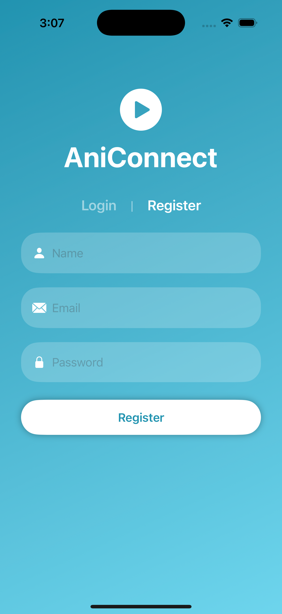 |

### Homepage

|  Movies     |   Search    | Details     |
|-------------|-------------|-------------|
| 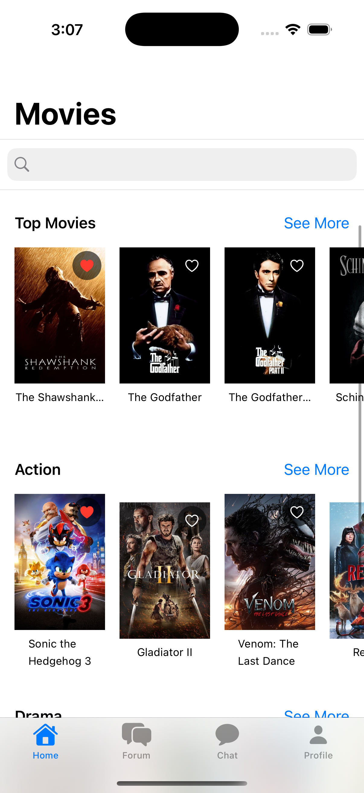 | 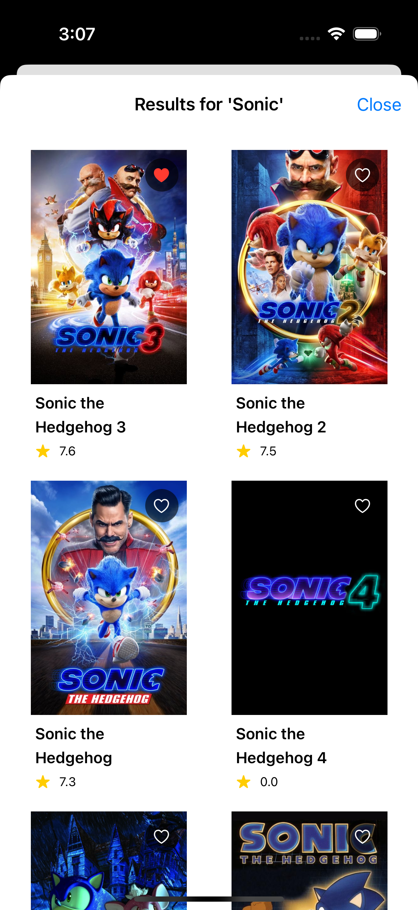 | 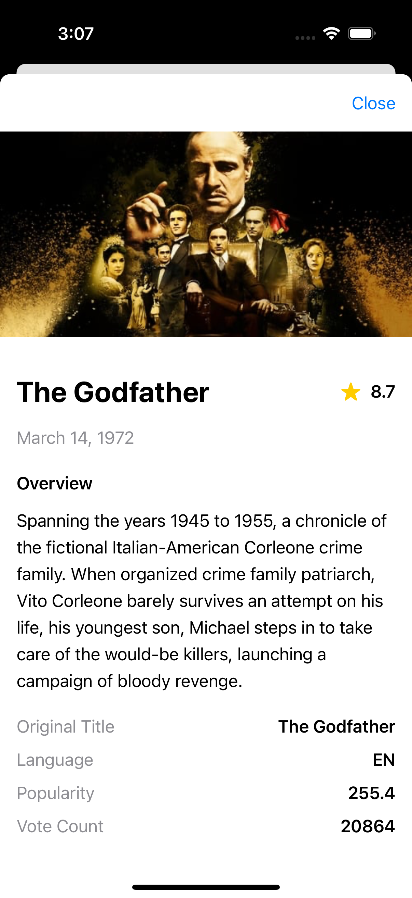 |

### Forum Page

|   Forum     |  Search     |  Post       |
|-------------|-------------|-------------|
| 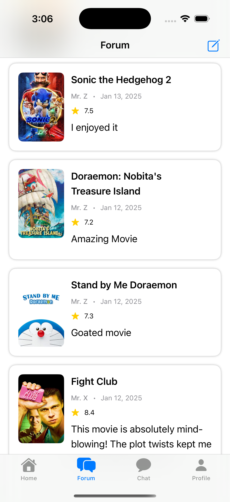 | 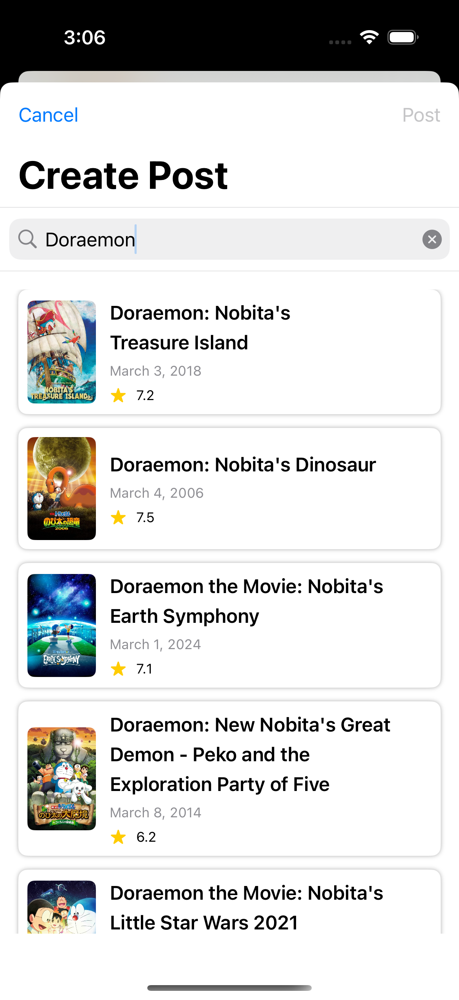 | 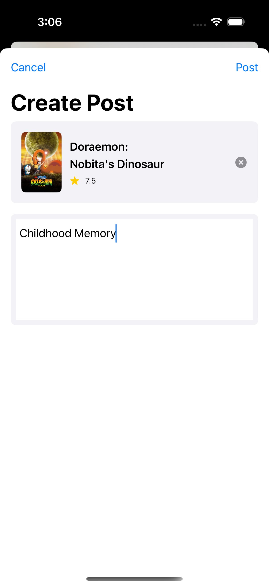 |

### AI Integration

|  Recom      |  Recom      | Chat        |
|-------------|-------------|-------------|
| 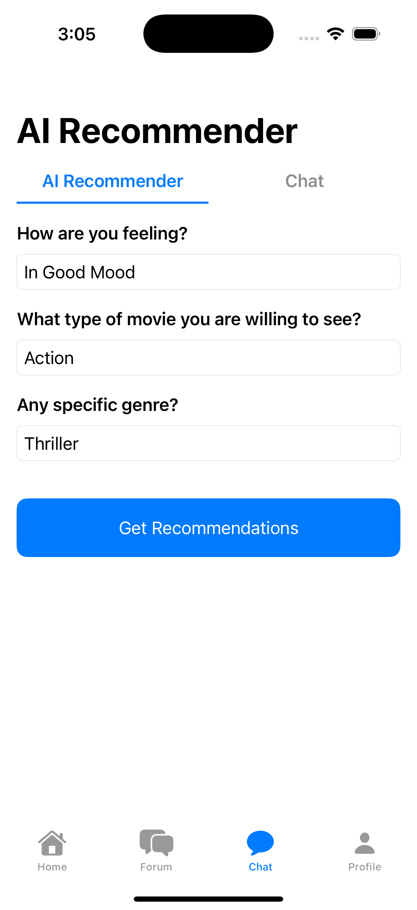 | 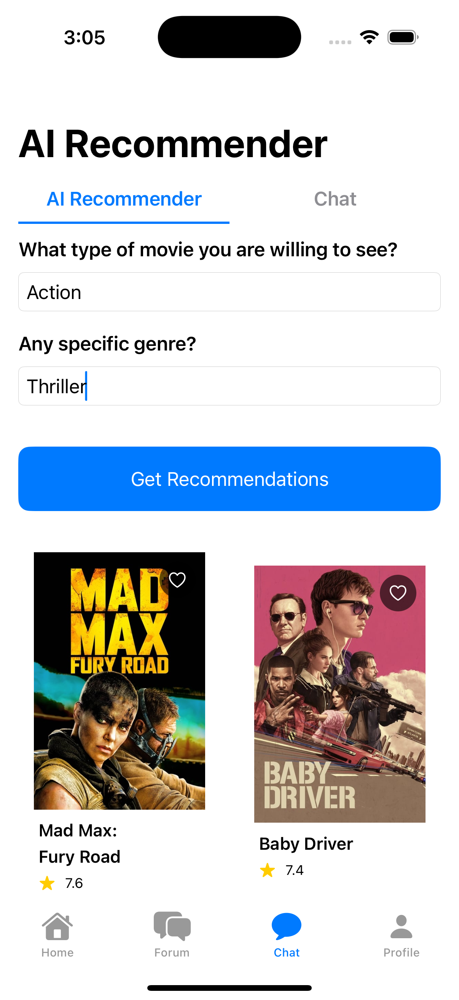 | 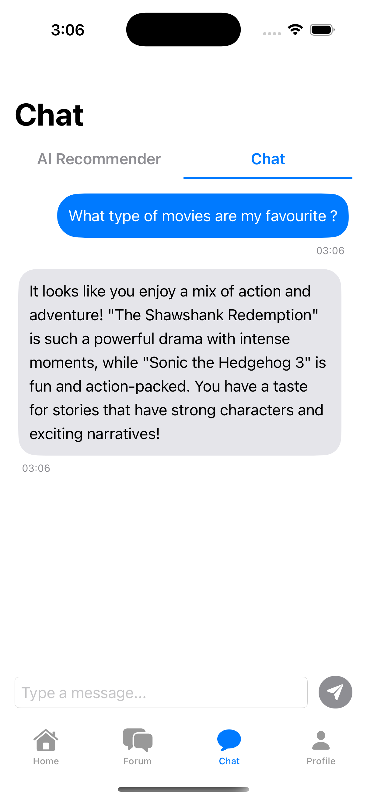 |

- **Movie Recommender**: Personalized suggestions based on preferences, favourites and previous review history.
- **AI Chat**: Context-aware interaction with access to user data like favorites and reviews.

